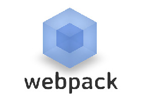

  
  <h3 align="center">The project created in Webpuck</h3>

__*link to example*__: https://dmytrokabluchii.github.io/Food-project/

Single page landing, responsive design.

Technologies used: HTML, CSS, Pure Java Script, JSON, AJAX, Webpuck, Core.js.
